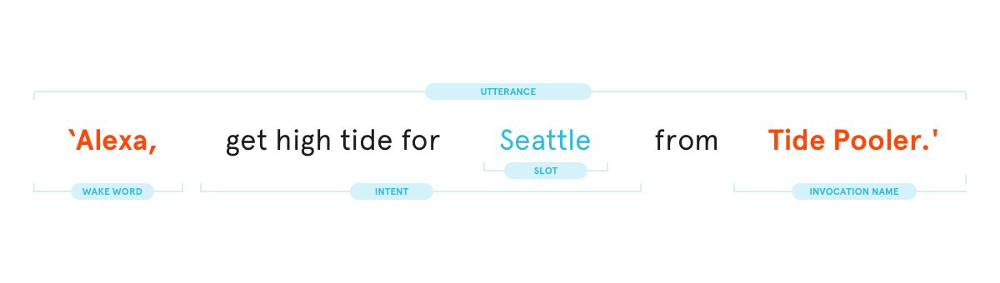
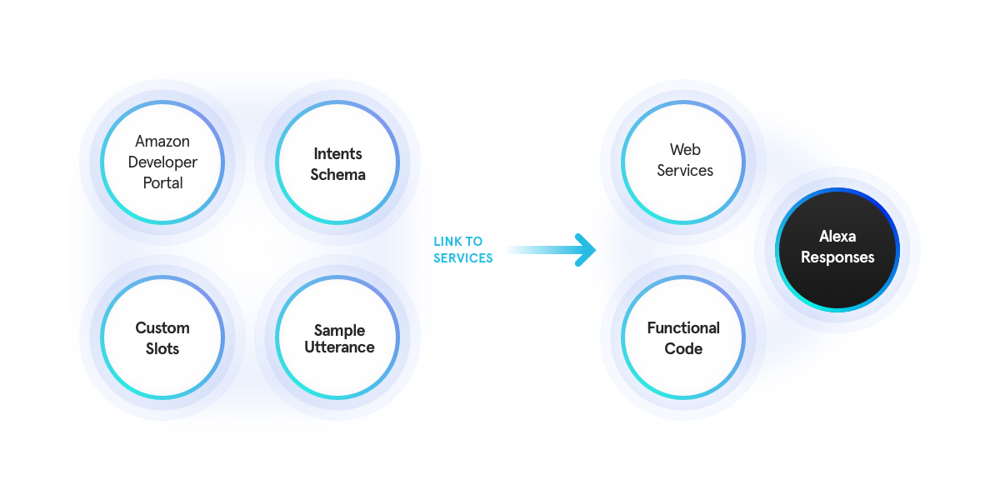

# Build Alexa Skills using NodeJS, AWS Lambda and Amazon Alexa Skills - test

## This workshop consists of two parts:
  * __Understanding how Amazon Alexa works and the components that come together when building an Alexa Skill application__
  * __Actually get our hands dirty with some JavaScript code that will be integrated in a AWS Lambda function and some easy-peasy configuration on Alexa Developer platform__

## Let's start with the basics:
  * Alexa can complete a wide variety of tasks for you - from adjusting your smart lighting, to playing your favourite Spotify playlist or calling an Uber. She uses ‘Skills’ to achieve this: you can think of a Skill as Amazon’s version of a voice-only app, and each feature of a particular Skill is call an ‘Intent’. Since Alexa recognises natural language, there could be several ways that these questions or commands can be phrased. Each spoken phrase that can be used to activate a single Intent is called an ‘Utterance’.

Confused? OK, let’s break down what each part of the diagram above means:

* An ‘Intent’ is the action a user requests Alexa complete - like a feature on an app.
* Each spoken phrase that can be used to activate a single Intent is called an ‘Utterance’.
* The Wake Word activates Alexa and can be either Alexa, Echo or Amazon (set by the user).
* The Invocation Name is a trigger which tells Alexa to use a specific Skill.
* The Slot is a defined place in the sentence where Alexa needs to capture user input (the city Seattle, in this example).
  Additionally, there are two types of responses that Alexa can give back to the user:
    * Tell Response: Alexa says one phrase, and then the session ends and the context is lost.
    * Ask Response: Alexa says one phrase back to the user and awaits an answer. In this case, the session is held open and context is retained.

### Developing Skills

The process of developing Skills is split into two parts.

Firstly, you have to code the main functionality that the Alexa Skill will achieve, and deploy it to a web service. We have been using Amazon’s Lambda serverless compute platform, which works very well with Alexa.

Secondly, you need to set it up on the Amazon Developer Services portal as an Alexa Skill. This part is called the voice interaction model, and involves defining your Intents, as well as the Slots they will use. There are a number of built-in Slots for recognising common concepts such as numbers and dates, but you can define custom ones as well.

In addition, you also need to define sample Utterances for your Skill in the portal. Essentially, these are examples of expected phrases that people will use in order to engage an Intent.

## At the following links, you are provided with code snippets that implement different topics. They vary in complexity level, so be sure to check the one that suits you best:
   [test](./tutorials/hello-world/index.md)
  
  
  
  
 
