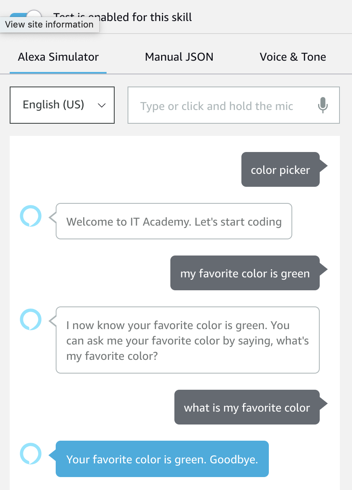

## Color Picker 


<br />

####For this skill we want to achieve the following result



Because there are 2 commands that you are throwing to Alexa, you require 2 more intents over your previous Hello World one. You can also change the invocation name if you want to. (i.e `color picker`)

The 2 intents may be `MyColorIsIntent` & `WhatsMyColorIntent`.

The utterance for `MyColorIsIntent` should be something like `MyColorIsIntent my favorite color is {Color}`. In this case, `Color` is a slot, so we need to define that as well. In order to do so, you can add it in the `MyColorIsIntent` screen, under section **Intent Slots**. Furtherfore, we need to associate it to a slot type so go to **Slot Types** tab and create a `LIST_OF_COLORS` type and paste in a list of colors (i.e green, red, blue, orange, gold, silver, yellow, black, white). Okay, cool! Now let's create sample utterances for the other intent as well.

Here's a list of possible utterances for `WhatsMyColorIntent`:

```
WhatsMyColorIntent what's my favorite color
WhatsMyColorIntent what is my favorite color
WhatsMyColorIntent what's my color
WhatsMyColorIntent what is my color
WhatsMyColorIntent my color
WhatsMyColorIntent my favorite color
WhatsMyColorIntent get my color
WhatsMyColorIntent get my favorite color
WhatsMyColorIntent give me my favorite color
WhatsMyColorIntent give me my color
WhatsMyColorIntent what my color is
WhatsMyColorIntent what my favorite color is
```

In the lambda function you need to create 2 other `case` blocks:
* Inside the `MyColorIsIntent` block, you need to get your hands on the spoken value. This resides in the following path: `event.request.intent.slots.Color.value`
You need to check if the value is inside there. It it is, you use it in building the speech and then you create a `sessionAttributes` object to pass back to Alexa, so that she will remember the value in the current session.
* Same thing will happen in the `WhatsMyColorIntent` but in here you don't need to send again the value to the Alexa service. You only need to use it in the voice output.