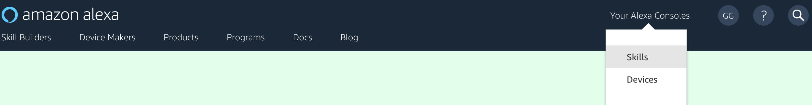
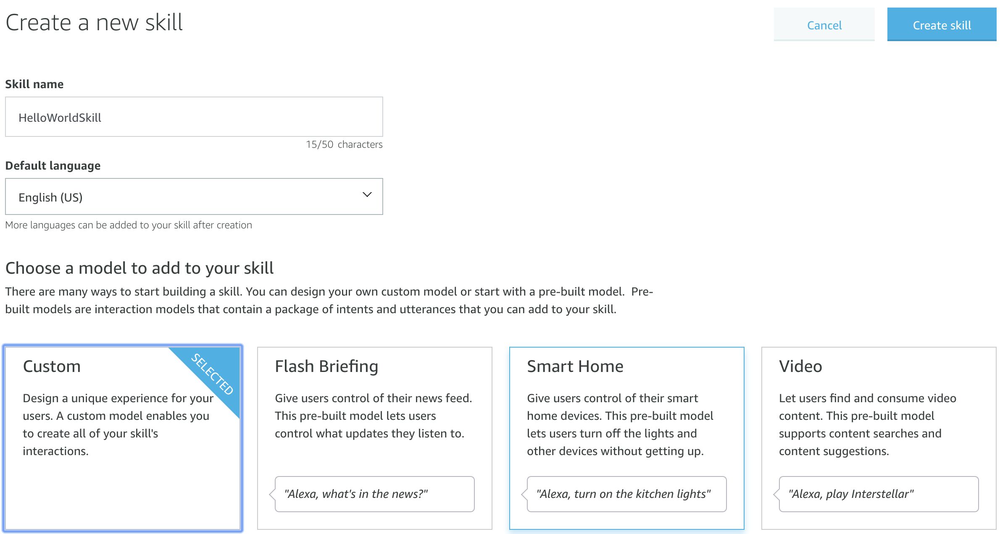
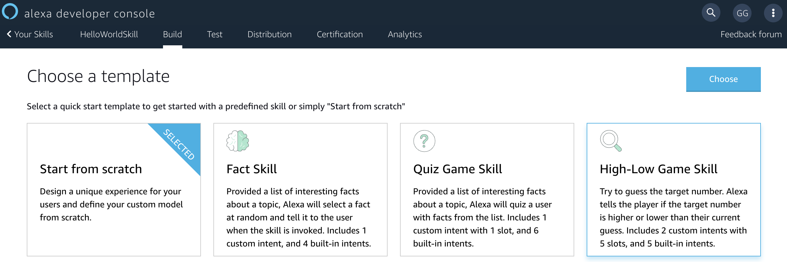
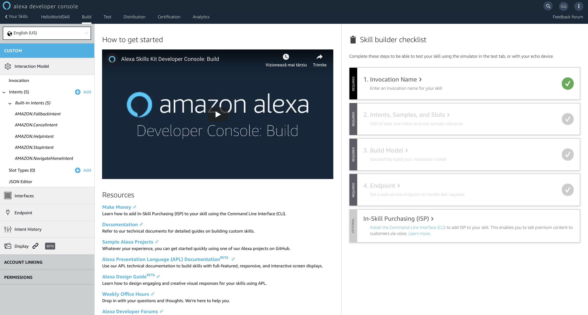
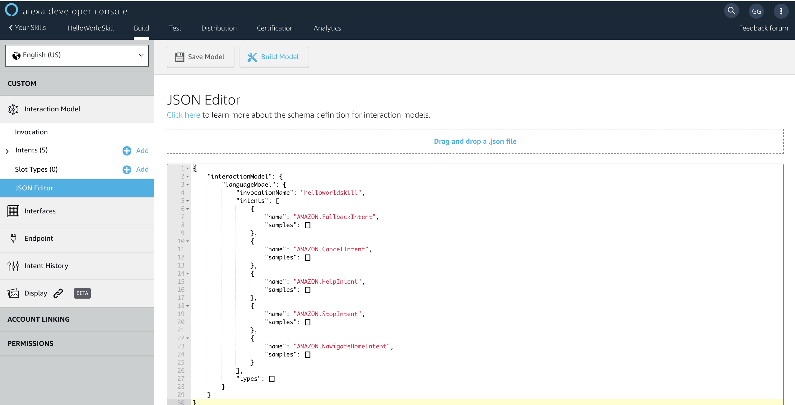
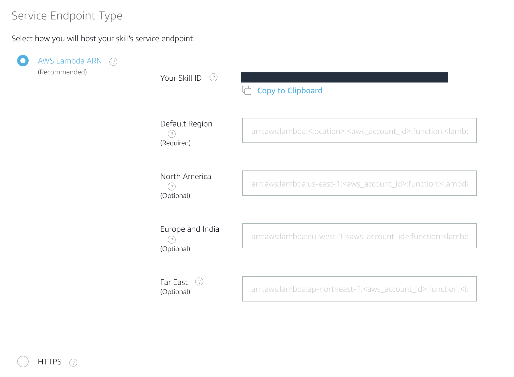

# Alexa Skills - Hello World Skill


[](./1-voice-user-interface.md)[](./2-lambda-function.md)[](./3-connect-vui-to-code.md)[](./4-testing.md)[](./5-next-steps.md)

1.  **Go to the [Amazon Alexa Developer Portal](http://developer.amazon.com/alexa?&sc_category=Owned&sc_channel=RD&sc_campaign=Evangelism2018&sc_publisher=github&sc_content=Survey&sc_detail=hello-world-nodejs-V2_GUI-1&sc_funnel=Convert&sc_country=WW&sc_medium=Owned_RD_Evangelism2018_github_Survey_hello-world-nodejs-V2_GUI-1_Convert_WW_beginnersdevs&sc_segment=beginnersdevs).  In the top-right corner of the screen, click the "Sign In" button.** Provide the credentials given you by the ABN AMRO TechLab team.


2.  Once you have signed in, move your mouse over the **Developer Console** text at the top of the screen and Select the **Your Alexa Consoles** and then the **Skills**  Link.

<br />
<br />



<br />
<br />

3.  From the **Alexa Skills Console** select the **Create Skill** button near the top-right of the list of your Alexa Skills.

4. Give your new skill a **Name**. This is the name that will be shown in the Alexa Skills Store, and the name your users will refer to.  For the sake of simplicity, we'll just use **English (US)**.  (You can add other languages later.)

5. Select the **Custom** model button to add it to your skill, and select the **Create Skill** button at the top right.

<br />
<br />



<br />
<br />

6. The next required step is to select a **Template** for your Alexa Skill. In the next screen you will be prompted with a selection of template skills. As far as we're concerned, we want to create a skill from scratch so make sure to have the **Start from scratch** template selected. Once you did that, click **Choose** to advance to the next panel, where we finally get to start building our custom skill.

<br />
<br />



<br />
<br />


After selection the template, you will be presented with the following screen, where you can see the **Interaction Model** which contains the Invocation, Intents, Slots as well as Endpoints. Also, you can see the **JSON Editor** as well which is very handy, because what we are going to do is basically add configuration to that JSON file through this nice and tidy user interface. 

This page has a lift of checkpoints called **Skill builder checklist**. By completing each step of this list, you will be able to test your skill using the simulator in the test tab, or with your echo device.

<br />
<br />



<br />
<br />


If something goes off, you can always see the end result in this section and modify it on the spot. You can see the contents of the JSON file if you click on the **JSON Editor**.
Make sure to remember the invocation name of your skill. You will need need later, in the testing phase, when you will ask Alexa to launch your newly created skill by it's name. You can see in this example, that the invocation name is __helloworldskill__. You can adjust this in the UI console or directly in the JSON file.

<br />
<br />



<br />
<br />

The voice interface is the interaction model, which is simply a mapping of all acceptable utterances your skill or app can handle. Reduce by adding some data to the intent schema which is a JSON object that declares intents and possible arguments called slots that your service can accept and process. 

The intent schema includes some standard intents (AMAZON.FallbackIntent, AMAZON.CancelIntent, AMAZON.HelpIntent, AMAZON.StopIntent,  AMAZON.NavigateHomeIntent ). You don't necessarily need to extend these built-in intents. But in case you wanted to add in some additional utterances to allow the user to cancel, stop or get help, this would be a good way to do so. The standard intents are used for common, general actions such as stopping, canceling, and asking for help.

Intents property represents an array that we will fill with intent objects. An intent object has a structure like this:

```javascript
{
    "name": "HelloWorld",               // name of your intent
    "slots": [],                        // possible arguments that your service can accept and process.
    "samples": [                        // the samples or so called utterances are a list of all the possible spoken phrases that can activate the current intent
        "geeks official salute",
        "greet me like a geek",
        "programmer's first words",
        "say hello world",
        "say hello",
        "say hi"
    ]
}
```

A good practice is to add the help intent as your last intent. Because if Alexa can't find a matching utterance, it will actually send to your endpoint the last intent on the list. This way you can return some suggestions to the user on things to say to make it easier to work with your app or skill. Now keep in mind that both the intent name and the slot names are case insensitive and must be unique.


7. **Build the Interaction Model for your skill**
    
    <br />

	1. On the left hand navigation panel, select the **JSON Editor** tab under **Interaction Model**. In the textfield provided, replace any existing code with the code provided in the [Interaction Model](../models/en-US.json).  Click **Save Model**.
    2. Click "Build Model".

    <br />

	**Note:** You should notice that **Intents** and **Slot Types** will auto populate based on the JSON Interaction Model that you have now applied to your skill. Feel free to explore the changes here, to learn more about **Intents**, **Slots**, and **Utterances** open our [technical documentation in a new tab](https://developer.amazon.com/docs/custom-skills/create-intents-utterances-and-slots.html?&sc_category=Owned&sc_channel=RD&sc_campaign=Evangelism2018&sc_publisher=github&sc_content=Survey&sc_detail=hello-world-nodejs-V2_GUI-1&sc_funnel=Convert&sc_country=WW&sc_medium=Owned_RD_Evangelism2018_github_Survey_hello-world-nodejs-V2_GUI-1_Convert_WW_beginnersdevs&sc_segment=beginnersdevs).

    <br />

8. **Optional:** Select an intent by expanding the **Intents** from the left side navigation panel. Add some more sample utterances for your newly generated intents. Think of all the different ways that a user could request to make a specific intent happen. A few examples are provided. Be sure to click **Save Model** and **Build Model** after you're done making changes here.

    <br />

9. Now, after we will also create the AWS lambda function, we need to make then two components communicate with the other. In order to to that, they need to identify each other. Just as we have ID cards and passports, these components have a unique ID as well. For the Voice User Interface, you need to go to **Endpoint** tab in the Alexa Developer console and check the **AWS Lambda ARN**. Next to it, you will find a weird looking string with random numbers and letters. This is **Your Skill ID** and you need to copy it as we will further need it when configuring our Lambda function. You'll find a very convenient **Copy to Clipboard** button underneath it. Make sure to click **Save Model** and **Build Model** after you're done making changes here.




10. If your interaction model builds successfully, proceed to the next step. If not, you should see an error. Try to resolve the errors. In our next step of this guide, we will be creating our Lambda function in the AWS developer console, but keep this browser tab open, because we will be returning here on [Page #3: Connect VUI to Code](./3-connect-vui-to-code.md).


     If you get an error from your interaction model, check through this list:

     *  **Did you copy & paste the provided code correctly?**
     *  **Did you accidentally add any characters to the Interaction Model?**

[](./2-lambda-function.md)
