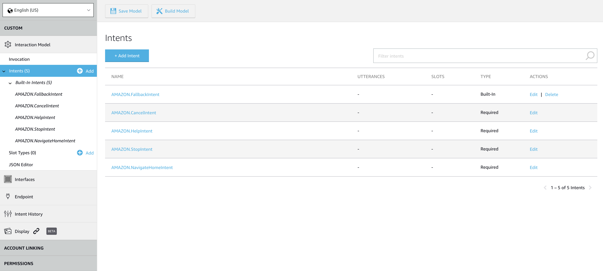
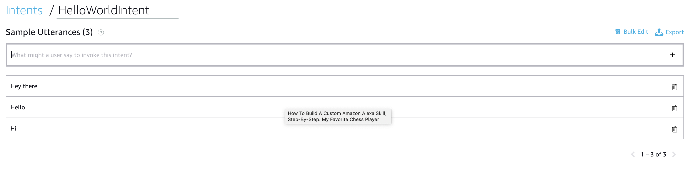
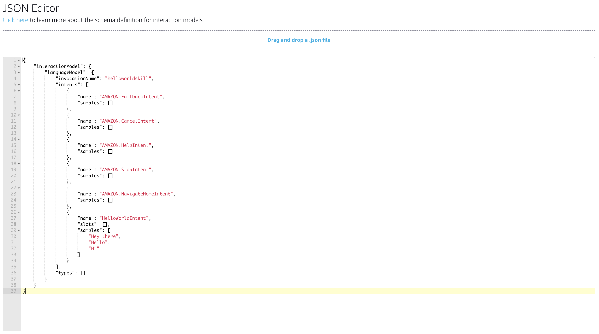

# Alexa Skills - Hello World Skill

1.  **Go to the [Amazon Alexa Developer Portal](https://developer.amazon.com/alexa).  In the top-right corner of the screen, click the "Sign In" button.** Provide the credentials given you by the ABN AMRO TechLab team.

2.  Once you have signed in, move your mouse over the **Developer Console** text at the top of the screen and Select the **Your Alexa Consoles** and then the **Skills**  Link.

 

 
 

3.  From the **Alexa Skills Console** select the **Create Skill** button near the top-right of the list of your Alexa Skills.

4. Give your new skill a **Name**. This is the name that will be shown in the Alexa Skills Store, and the name your users will refer to.  For the sake of simplicity, we'll just use **English (US)**.  (You can add other languages later.)

 
 

 
 

5. Select the **Custom** model button to add it to your skill, and select the **Create Skill** button at the top right. As for the hosting methods, the one that we desire is the default one so you don't need to worry about that. You may proceed further!

 

6. The next required step is to select a **Template** for your Alexa Skill. In the next screen you will be prompted with a selection of template skills. As far as we're concerned, we want to create a skill from scratch so make sure to have the **Start from scratch** template selected. Once you did that, click **Choose** to advance to the next panel, where we finally get to start building our custom skill.

 
 

 
 

7. After selection of the template, you will be presented with the following screen, where you can see the **Interaction Model** which contains the Invocation, Intents, Slots as well as Endpoints. Also, you can see the **JSON Editor** as well which is very handy, because what we are going to do is basically add configuration to that JSON file through this nice and tidy user interface. 

This page has a lift of checkpoints called **Skill builder checklist**. By completing each step of this list, you will be able to test your skill using the simulator in the test tab, or with your echo device.

 
 

 
 

8. Now, let's create our own custom intent. Click on the **Intents** item in the left side of the screen and then press **Add Intent**.

 

 

9. You will be prompted to an input field where we need to give a custom name to our intent. Let's type in **HelloWorldIntent** and then hit **Create custom intent**. After this, we need to add the utterances that will invoke out custom intent in the end. Think of all the different ways that a user could request to activate our intent. A few examples could be: **Hi, Hello, Hey there**. Hit 'Enter' after every sample that you are typing in. Be sure to click **Save Model** after you're done making changes here. If you want to know more about intents and about their structure, you can check that out [here](./intents-more-information.md).

 
 

10. If you now check the JSON from the **JSON Editor** tab, you will see that the modification you made in the UI are reflected in the JSON file itself.

 
 

 
 

11. Now, after we will also create the AWS lambda function, we need to make then two components communicate with the other. In order to to that, they need to identify each other. Just as we have ID cards and passports, these components have a unique ID as well. For the Voice User Interface, you need to go to **Endpoint** tab item in the left side of the screen and select the **AWS Lambda ARN** option for your endpoint.

 

Next to it, you will find a weird looking string with random numbers and letters. This is **Your Skill ID** and you need to copy it as we will further need it when configuring our Lambda function. You'll find a very convenient **Copy to Clipboard** button underneath it. You can keep the tab open as we need to come back here again in a few minutes.

 
 

 
 

