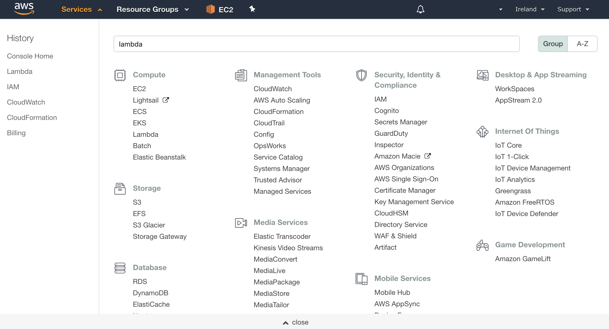
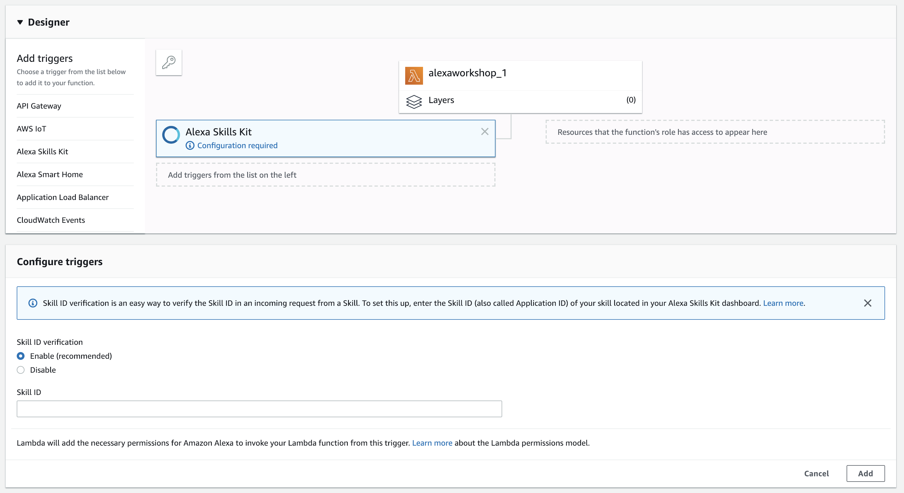
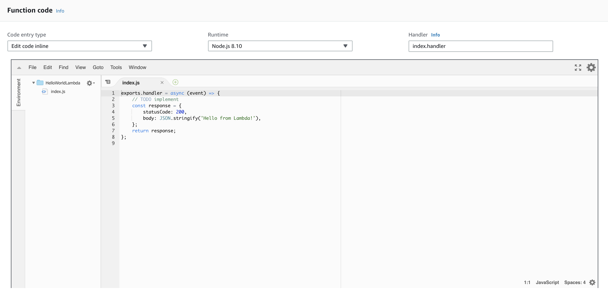
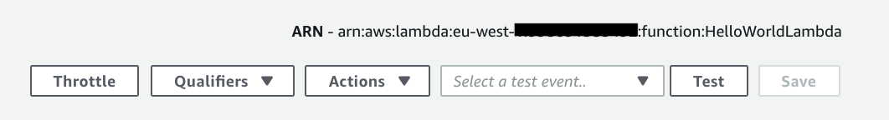

[](./1-voice-user-interface.md)[](./2-lambda-function.md)[](./3-connect-vui-to-code.md)[](./4-testing.md)[](./5-customize.md)

## Setting Up A Lambda Function Using Amazon Web Services

In the [first step of this guide](./1-voice-user-interface.md), we built the Voice User Interface (VUI) for our Alexa skill.  On this page, we will be creating an AWS Lambda function using [Amazon Web Services](http://aws.amazon.com).  You can [read more about what a Lambda function is](http://aws.amazon.com/lambda), but for the purposes of this guide, what you need to know is that AWS Lambda is where our code lives.  When a user asks Alexa to use our skill, it is our AWS Lambda function that interprets the appropriate interaction, and provides the conversation back to the user.

1.  **Go to https://technologylab.signin.aws.amazon.com/console and sign in to the console with the credentials provided to you by the ABN AMRO TechLab team**. :sunglasses:
    **You need to provide `technologylab` as Account ID alongside the given credentials**.

  <br />
  <br />

  [](https://technologylab.signin.aws.amazon.com/console)

  <br />
  <br />

2. **Click "Services" at the top of the screen, and type "Lambda" in the search box.**  You can also find Lambda in the list of services.  It is in the "Compute" section. Once you found it, click on it to proceed further.



<br />

3. For your convenience, we have already created lambda functions for you. If you want to create a lambda function from scratch, you can follow the extra adjacent steps available [here](./adjacent-step-creating-lambda-function.md). It's just there for you to use in the future but for now you can proceed without that step. Let's move on.


<br />

4. Be sure to check the lambda function associated with your team number from the list of available lambdas. Those are: 

* alexaworkshop_1
* alexaworkshop_2
* alexaworkshop_3
* alexaworkshop_4
* alexaworkshop_5
* alexaworkshop_6


This will be your playground for the following hours. On the left side of the screen you can see a list of triggers. Click on the `Alexa Skills Kit` trigger and you can now see the coresponding screen below, in a section called **Configure triggers**.




Inside the **Skill ID** field make sure to fill in the Skill ID that you have in clipboard from the **Alexa Developer Console**. Now, if you have good attention to details you might have already observed an important aspect: the lambda function has an unique ID for itself, which we need to copy and paste in the endpoint field of the **Alexa Developer Console**, once we set up the lambda function. After pasting the Skill ID, make sure to hit **Add** and **Save** so we can continue our journey.


  <br />


5. Clicking on the Lambda function name (_alexaworkshop_x_) in the **Designer** view, you will be prompted with the lambda main screen. If you scroll down for a bit, you will see a section/tab called **Function code**

  <br />
  <br />



  <br />
  <br />

6. Inside this, under the `index.js` file, you can see the actual code that is going to be executed once your lambda function is going to be called by our custom skill. I have already prepared the code for you with some comments as well, so make sure to check them.

Now, replace the contents of the `index.js` file with the following:

  <br />
  <br />

```javascript

/**
 * AWS Lambda invokes your Lambda function via a {handler} object. 
 * A handler represents the name of your Lambda function (and serves as the entry point that AWS Lambda uses to execute your function code
 */

/**
 * 
 * @param {event} - will provide information about the originating request
 * @param {context} - contains meta information about the request / running Lambda instance / function's execution 
 * @param {callback} - is used to send information back to the caller and signal that your Lambda invocation is complete
 */
exports.handler = (event, context, callback) => {

  // this intent should be the intent name that you provided in the Voice User Interface
  const INTENT_NAME = "HelloWorldIntent"

  // this message should hold the value that you want Alexa to speak when the intent is invoked with one of the utterances 
  const MESSAGE = "Hello World"

  switch (event.request.type) {
    case "LaunchRequest":
      context.succeed(generateResponse(buildSpeechletResponse("Welcome to IT Academy. You created your first Alexa Skill! Congratulations! Let's do some shots now! First round is on Melvin Broekhuizen", false)))
      break;
    case "IntentRequest":
      switch (event.request.intent.name) {
        case INTENT_NAME: {
          context.succeed(generateResponse(buildSpeechletResponse(MESSAGE), false))
          break;
        }

      }
      break;
  }
}

/**
 * this function will specify the output that Alexa will eventually speak, in the form of plain text. 
 * It also takes another variable, shouldEndSession, which specifies whether Alexa should end the session after the response or not.
 */
const buildSpeechletResponse = (outputText, shouldEndSession) => {
  return {
    outputSpeech: {
      type: "PlainText",
      text: outputText,
    },
    shouldEndSession: shouldEndSession
  }
}

// this function will generate the response returned by the Lambda function using the {buildSpeechletResponse} function
const generateResponse = (speechletResponse) => {
  return {
    version: "1.0",
    response: speechletResponse
  }
}
```

  <br />
  <br />

7. After making the required modifications, make sure to save the Lambda function by clicking on the orange **Save** button located in the upper-right side of your screen.

<br />

8. Final step that we will do here is to **Copy the ARN value for this Lambda function** for use in the next section of the guide. Don't forget to save if you made other modifications. 

  <br />
  <br />



  <br />
  <br />

[](./3-connect-vui-to-code.md)
