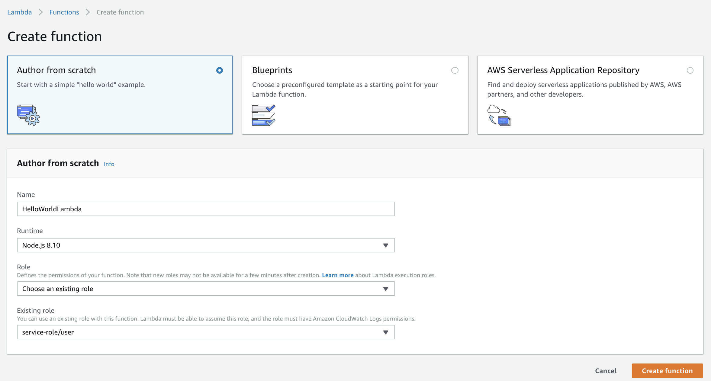
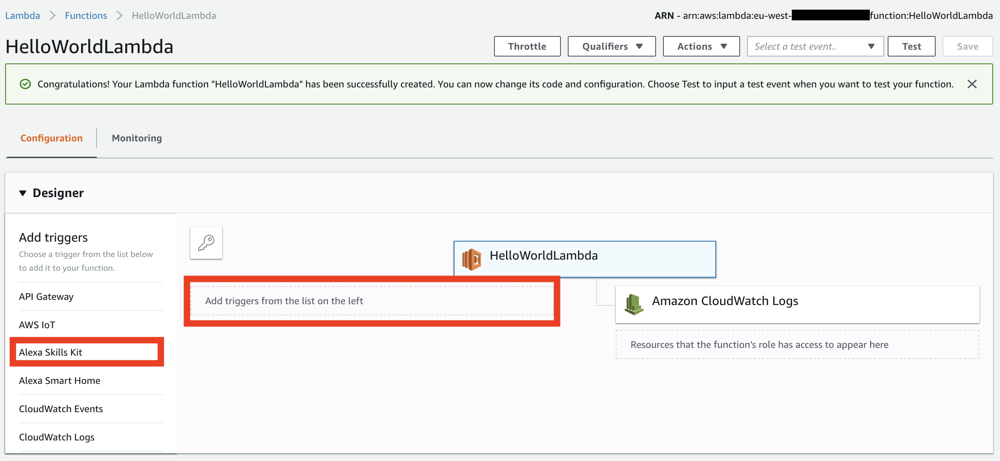
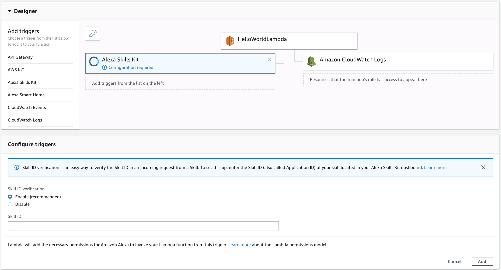

[](./1-voice-user-interface.md)[](./2-lambda-function.md)[](./3-connect-vui-to-code.md)[](./4-testing.md)[](./5-next-steps.md)

## Setting Up A Lambda Function Using Amazon Web Services

In the [first step of this guide](./1-voice-user-interface.md), we built the Voice User Interface (VUI) for our Alexa skill.  On this page, we will be creating an AWS Lambda function using [Amazon Web Services](http://aws.amazon.com).  You can [read more about what a Lambda function is](http://aws.amazon.com/lambda), but for the purposes of this guide, what you need to know is that AWS Lambda is where our code lives.  When a user asks Alexa to use our skill, it is our AWS Lambda function that interprets the appropriate interaction, and provides the conversation back to the user.

1.  **Go to http://console.aws.amazon.com and sign in to the console with the credentials provided to you by the ABN AMRO TechLab team**. :sunglasses:

  <br />

  [](https://console.aws.amazon.com/console/home)

  <br />

2.  **Click "Services" at the top of the screen, and type "Lambda" in the search box.**  You can also find Lambda in the list of services.  It is in the "Compute" section.


3.  **Check your AWS region.** AWS Lambda only works with the Alexa Skills Kit in these regions: US East (N. Virginia), US West (Oregon), Asia Pacific (Tokyo)  and EU (Ireland).  Make sure you choose the region closest to your customers. In our case, we will select the region **EU (Ireland)**.

<br />


<br />

4.  **Click the orange "Create function" button.** It should be near the top of your screen.  (If you don't see this button, it is because you haven't created a Lambda function before.  Click the blue "Get Started" button near the center of your screen.)

  <br />

  

  <br />

5.  There are three boxes labeled "Author from scratch", "Blueprints" and "Serverless Application Repository". **Click the radio button in the box titled "Author from scratch"**. After that, fill in the required fields. Give the lambda a suggestive name and leave the __Runtime__ section set to NodeJS. As for the role, make sure to select **Choose an existing role** and fill in the existing role provided to you by the ABN AMRO TechLab team. After everyting is in place, hit the **Create function** button again and roll up your sleeves.

  <br />



<br />

Whop-whoop! Your lambda function has been created as you are hopefully prompted with the following message **Congratulations! Your Lambda function "`your-lambda-function-name-here`" has been successfully created. You can now change its code and configuration.**. At the moment, the lambda function doesn't do anything ... yet. That's because right now, the lambda doesn't know anything about our Alexa Skill configuration. They are like two teenagers that seek to meet their perfect match, so let's facilitate their date. 

<br />



<br />

6. In the designer tab, you will see your lambda function name, in my case **"HelloWorldLambda"**. Under it, you can see a list of triggers. A trigger represents a service that we can configure to call our lambda function in order to execute it and get the results of the execution. Make sure to select **"Alexa Skills Kit"** from the list and by doing so, you will see that it will pop right under your Lambda with a very informative message: **Configuration required**


<br />



<br />

7. If you read all the messages available is this screen, you will realise that we are about to let love happen. Inside the **Skill ID** field make sure to fill in the Skill ID that you have in clipboard from the Alexa Developer Console. Now, if you have good attention to details you might have already observed an important aspect: the lambda function has an unique ID for itself, which we need to copy and paste in the endpoint tab of the Alexa Developer Console, once we set up the lambda function. After pasting the Skill ID, make sure to hit **Add** so we can continue our journey.

<br />

8. Clicking back on the Lambda function name, you will be prompted with the previous screen. If you scroll down for a bit, you will see a section/tab called **Function code**

<br />


<br />

9. Inside this, under the `index.js` file, you can see the actual code that is going to be executed once your lambda function is going to be called by our custom skill. I have already prepared the code for you with some comments as well, so make sure to check them.

Now, replace the contents of the `index.js` file with the following:

```javascript

/**
 * AWS Lambda invokes your Lambda function via a {handler} object. 
 * A handler represents the name of your Lambda function (and serves as the entry point that AWS Lambda uses to execute your function code
 */

/**
 * 
 * @param {event} - will provide information about the originating request
 * @param {context} - contains meta information about the request / running Lambda instance / function's execution 
 * @param {callback} - is used to send information back to the caller and signal that your Lambda invocation is complete
 */
exports.handler = (event, context, callback) => {

  // this intent should be the intent name that you provided in the Voice User Interface
  const INTENT_NAME = "HelloWorldIntent"

  // this message should hold the value that you want Alexa to speak when the intent is invoked with one of the utterances 
  const MESSAGE = "Hello World"

  switch (event.request.type) {
    case "LaunchRequest":
      context.succeed(generateResponse(buildSpeechletResponse("Welcome to IT Academy. Let's start coding", false)))
      break;
    case "IntentRequest":
      switch (event.request.intent.name) {
        case INTENT_NAME: {
          context.succeed(generateResponse(buildSpeechletResponse(MESSAGE), false))
          break;
        }

      }
      break;
  }
}

/**
 * this function will specify the output that Alexa will eventually speak, in the form of plain text. 
 * It also takes another variable, shouldEndSession, which specifies whether Alexa should end the session after the response or not.
 */
const buildSpeechletResponse = (outputText, shouldEndSession) => {
  return {
    outputSpeech: {
      type: "PlainText",
      text: outputText,
    },
    shouldEndSession: shouldEndSession
  }
}

// this function will generate the response returned by the Lambda function using the {buildSpeechletResponse} function
const generateResponse = (speechletResponse) => {
  return {
    version: "1.0",
    response: speechletResponse
  }
}
```

10. After making the required modifications, make sure to save the Lambda function by clicking on the orange **Save** button located in the upper-right side of your screen.

11. Final step that we will do here is to **Copy the ARN value for this Lambda function** for use in the next section of the guide. Don't forget to save. 

<br />


<br />

[](./3-connect-vui-to-code.md)
