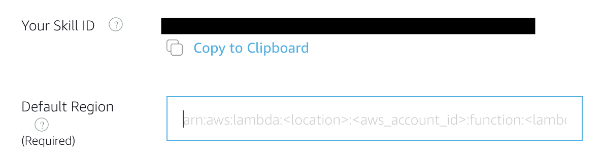

## Connecting Your Voice User Interface To Your Lambda Function

On [page #1](./1-voice-user-interface.md) of this guide, we created a voice user interface for the intents and utterances we expect from our users.  On [page #2](./2-lambda-function.md), we created a Lambda function that contains all of our logic for the skill.  On this page, we need to connect those two pieces together.

1.  **Go back to the tab where you left the [Amazon Developer Portal](https://developer.amazon.com/alexa/console/ask?&sc_category=Owned&sc_channel=RD&sc_campaign=Evangelism2018&sc_publisher=github&sc_content=Survey&sc_detail=hello-world-nodejs-V2_GUI-3&sc_funnel=Convert&sc_country=WW&sc_medium=Owned_RD_Evangelism2018_github_Survey_hello-world-nodejs-V2_GUI-3_Convert_WW_beginnersdevs&sc_segment=beginnersdevs) open.** 

2. You should be in the **Endpoint** tab. If not, select the **Endpoint** tab on the left side navigation panel.

- You have the ability to host your code anywhere that you would like, but for the purposes of simplicity and frugality, we are using AWS Lambda.

3.  Paste your Lambda's ARN (Amazon Resource Name) into the textbox provided for **Default Region**.

   
   

   
   

4. Click the **Save Endpoints** button at the top of the main panel. Also click on the **Intents** tab from the left side navigation panel. You are now back in the _Intents_ menu where you can see **Save Model** and **Build Model** buttons at the top side of the page. You many now build the model by clicking on the **Build Model** button. This operation might take some time so .. sit back and relax. You will be notified when the model build is complete with a *Build Successful* message.

* Note: If you did other modifications, you might see that the **Save Model** button has a blue color. If this applies to you case, make sure to first **Save Model** before building the model.

5. **Click the "Next" button to continue to page #4 of this guide.**

   
   

