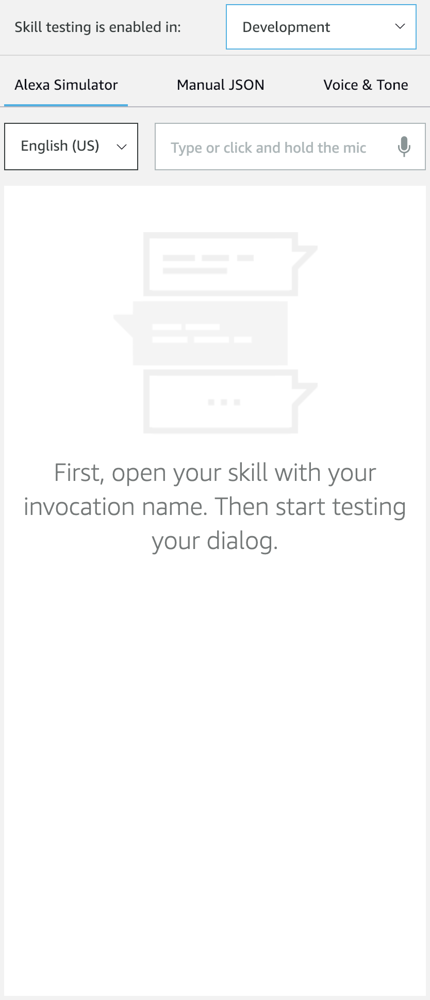

## Testing Your Alexa Skill

So far, we have [created a Voice User Interface](./1-voice-user-interface.md), [a Lambda function](./2-lambda-function.md), and [connected the two together](./3-connect-vui-to-code.md).  Your skill is now ready to be tested.

1. If everything is all good and you followed all the steps, click on the **Build** tab on the top menu. You should be able to see the _Skill builder checklist_ all checked up on the right side of the screen. Congrats!

   
   

   
   

2. Now, let's test out our fresh new skill. Access the **Alexa Simulator**, by selecting the **Test** tab from the top navigation menu.

 

3. Enabling Testing is really easy. At first, the simulator will display **Test is disabled for this skill** and you should see the **Off** option selected. Click in the drop-down and select **Development**. After, you should see the label changed to **Skill testing is enabled in: Development**.
   
   

   
   

5. To validate that your skill is working as expected, invoke your skill from the **Alexa Simulator**. You can either type or click and hold the mic from the input box to use your voice.
	1. **Type** "Open" followed by the invocation name you gave your skill in [Step 1](./1-voice-user-interface.md). For example, "Open helloworldskill".
	2. **Use your voice** by clicking and holding the mic on the side panel and saying "Open" followed by the invocation name you gave your skill.
	3. **If you've forgotten the invocation name** for your skill, revisit the **Build** panel on the top navigation menu and select **Invocation** from the sidebar to review it.

  During testing, you should see the skill behave like this:

   
   

  

   
   

6. Ensure your skill works the way that you designed it to.
	* After you interact with the Alexa Simulator, you should see the Skill I/O **JSON Input** and **JSON Output** boxes get populated with JSON data. You can also view the **Device Log** to trace your steps.
	* If it's not working as expected, you can dig into the JSON to see exactly what Alexa is sending and receiving from the endpoint. If something is broken, AWS Lambda offers an additional testing tool to help you troubleshoot your skill.

7.  **Configure a test event in AWS Lambda.** Now that you are familiar with the **request** and **response** boxes in the Service Simulator, it's important for you to know that you can use your **requests** to directly test your Lambda function every time you update it.  To do this:
    1.  Enter an utterance in the service simulator, and copy the generated Lambda Request (JSON Input) for the next step.

    2.  **Open your Lambda function in AWS, open the Actions menu, and select "Configure test events."**

     
     

    

     
     

    3.  Select "Create new test event". You can choose any test event in the list, as they are just templated event requests, but you can use the default **Hello World** template. Now let's add the test data.

    4. Delete the contents of the code editor, and paste the Lambda request you copied above into the code editor. The Event Name is only visible to you. Name your test event something descriptive and memorable. For our example, we entered **MyHelloWorldTest**. Additionally, by copying and pasting your Lambda Request from the service simulator, you can test different utterances and skill events beyond the pre-populated templates in Lambda.

    5.  **Click the "Create" button.** This will save your test event and bring you back to the main configuration for your lambda function.

  
     
     

  

  

6.  **Click the "Test" button to execute the test event.**

This gives you visibility into four things:

*  **Your response, listed in the "Execution Result."**

 

 

*  **A Summary of the statistics for your request.** This includes things like duration, resources, and memory used.

 

 

*  **Log output.**  By effectively using console.log() statements in your Lambda code, you can track what is happening inside your function, and help to figure out what is happening when something goes wrong.  You will find the log to be incredibly valuable as you move into more advanced skills.

 

 

*  **A link to your [CloudWatch](https://console.aws.amazon.com/cloudwatch/home?region=eu-west-1#logs:) logs for this function.**  This will show you **all** of the responses and log statements from every user interaction.  This is very useful, especially when you are testing your skill from a device with your voice.  (It is the "[Click here](https://console.aws.amazon.com/cloudwatch/home?region=us-east-1#logs:)" link in the Log Output description.)

 
    
8.  **If your sample skill is working properly, you can [now customize your skill](./5-customize.md). You're awesome!**
