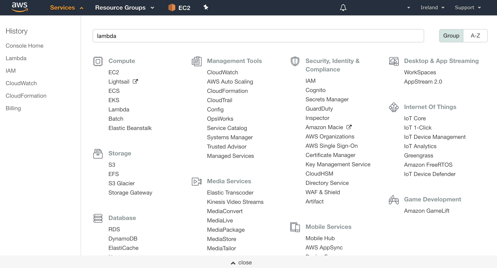

1.  **Go to https://technologylab.signin.aws.amazon.com/console and sign in to the console with the credentials provided to you by the ABN AMRO TechLab team**. :sunglasses:
    **You need to provide `technologylab` as Account ID alongside the given credentials**.

   
   

  

   
   

2.  **Click "Services" at the top of the screen, and type "Lambda" in the search box.**  You can also find Lambda in the list of services.  It is in the "Compute" section.

3.  **Check your AWS region.** AWS Lambda only works with the Alexa Skills Kit in these regions: US East (N. Virginia), US West (Oregon), Asia Pacific (Tokyo)  and EU (Ireland).  Make sure you choose the region closest to your customers. In our case, we will select the region **EU (Ireland)**.

 
 

 
 

4.  **Click the orange "Create function" button.** It should be near the top of your screen.  (If you don't see this button, it is because you haven't created a Lambda function before.  Click the blue "Get Started" button near the center of your screen.)

   
   

  

   
   

5.  There are three boxes labeled "Author from scratch", "Blueprints" and "Serverless Application Repository". **Click the radio button in the box titled "Author from scratch"**. After that, fill in the required fields. Give the lambda a suggestive name and leave the __Runtime__ section set to NodeJS. As for the role, make sure to select **Choose an existing role** and fill in the existing role provided to you by the ABN AMRO TechLab team. After everyting is in place, hit the **Create function** button again and roll up your sleeves.
  
   
   

   
   

Whop-whoop! Your lambda function has been created as you are hopefully prompted with the following message **Congratulations! Your Lambda function "`your-lambda-function-name-here`" has been successfully created. You can now change its code and configuration.**. At the moment, the lambda function doesn't do anything ... yet. That's because right now, the lambda doesn't know anything about our Alexa Skill configuration. They are like two teenagers that seek to meet their perfect match, so let's facilitate their date. 

   
   

   
   

6. In the designer tab, you will see your lambda function name, in my case **"HelloWorldLambda"**. Under it, you can see a list of triggers. A trigger represents a service that we can configure to call our lambda function in order to execute it and get the results of the execution. Make sure to select **"Alexa Skills Kit"** from the list and by doing so, you will see that it will pop right under your Lambda with a very informative message: **Configuration required**

   
   

   
   

7. If you read all the messages available is this screen, you will realise that we are about to let love happen. Inside the **Skill ID** field make sure to fill in the Skill ID that you have in clipboard from the Alexa Developer Console. Now, if you have good attention to details you might have already observed an important aspect: the lambda function has an unique ID for itself, which we need to copy and paste in the endpoint tab of the Alexa Developer Console, once we set up the lambda function. After pasting the Skill ID, make sure to hit **Add** so we can continue our journey.

   
   
