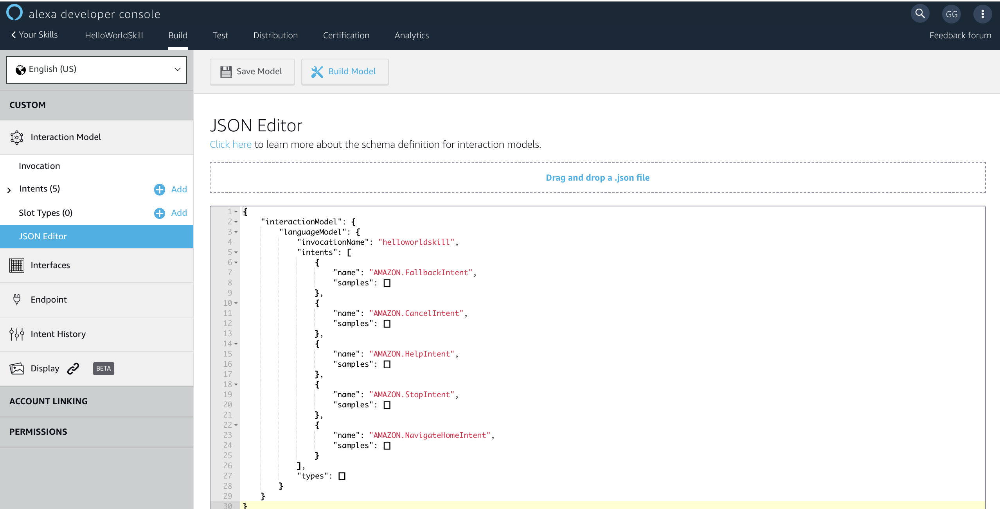

If something goes off, you can always see the end result in the **JSON Editor** section and modify it on the spot. You can see the contents of the JSON file if you click on the **JSON Editor**.
Make sure to remember the invocation name of your skill. You will need need later, in the testing phase, when you will ask Alexa to launch your newly created skill by it's name. You can see in this example, that the invocation name is __helloworldskill__. You can adjust this in the UI console or directly in the JSON file.

<br />
<br />



<br />
<br />

The voice interface is the interaction model, which is simply a mapping of all acceptable utterances your skill or app can handle. Reduce by adding some data to the intent schema which is a JSON object that declares intents and possible arguments called slots that your service can accept and process. 

The intent schema includes some standard intents (AMAZON.FallbackIntent, AMAZON.CancelIntent, AMAZON.HelpIntent, AMAZON.StopIntent,  AMAZON.NavigateHomeIntent ). You don't necessarily need to extend these built-in intents. But in case you wanted to add in some additional utterances to allow the user to cancel, stop or get help, this would be a good way to do so. The standard intents are used for common, general actions such as stopping, canceling, and asking for help.

Intents property represents an array that we will fill with intent objects. An intent object has a structure like this:

```javascript
{
    "name": "HelloWorld",               // name of your intent
    "slots": [],                        // possible arguments that your service can accept and process.
    "samples": [                        // the samples or so called utterances are a list of all the possible spoken phrases that can activate the current intent
        "geeks official salute",
        "greet me like a geek",
        "programmer's first words",
        "say hello world",
        "say hello",
        "say hi"
    ]
}
```

A good practice is to add the help intent as your last intent. Because if Alexa can't find a matching utterance, it will actually send to your endpoint the last intent on the list. This way you can return some suggestions to the user on things to say to make it easier to work with your app or skill. Now keep in mind that both the intent name and the slot names are case insensitive and must be unique. 


**Note:** You should notice that **Intents** and **Slot Types** will auto populate based on the JSON Interaction Model that you have now applied to your skill. Feel free to explore the changes here, to learn more about **Intents**, **Slots**, and **Utterances** open [Amazon's technical documentation in a new tab](https://developer.amazon.com/docs/custom-skills/create-intents-utterances-and-slots.html?&sc_category=Owned&sc_channel=RD&sc_campaign=Evangelism2018&sc_publisher=github&sc_content=Survey&sc_detail=hello-world-nodejs-V2_GUI-1&sc_funnel=Convert&sc_country=WW&sc_medium=Owned_RD_Evangelism2018_github_Survey_hello-world-nodejs-V2_GUI-1_Convert_WW_beginnersdevs&sc_segment=beginnersdevs).


	
