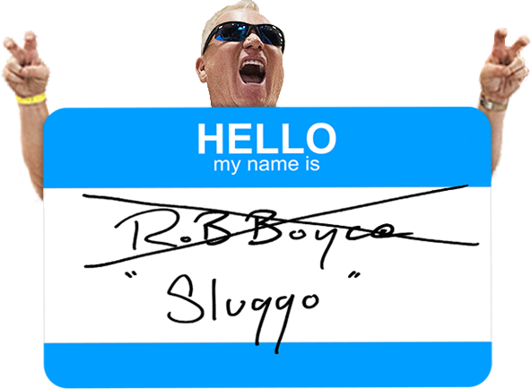

# Nicknames

#### This use case is a bit more advanced than the `Color Picker` example because this one will make use of a node library called node-fetch.
#### This will enable you to make calls over the internet to a open-source API which spits out weird funny word combinations everytime you call it.

#### API Endpoint: `https://api.codetunnel.net/random-nick`